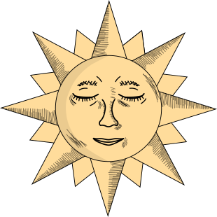
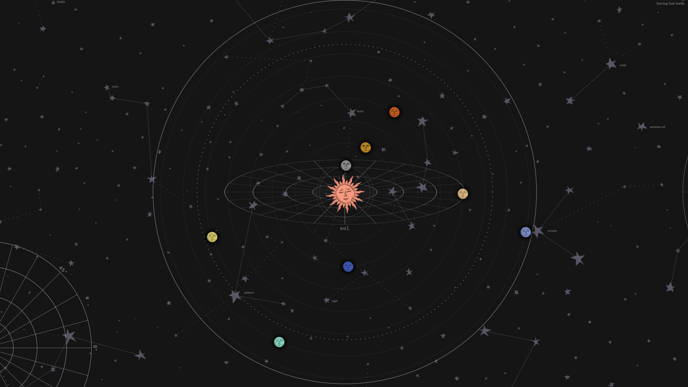
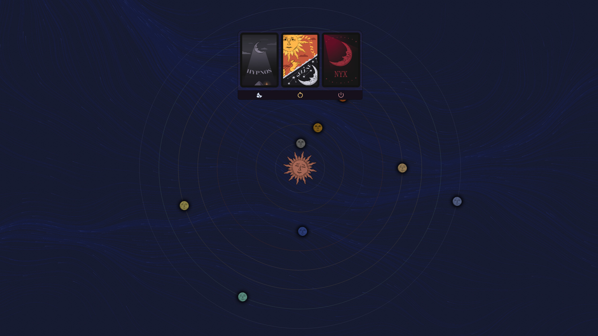
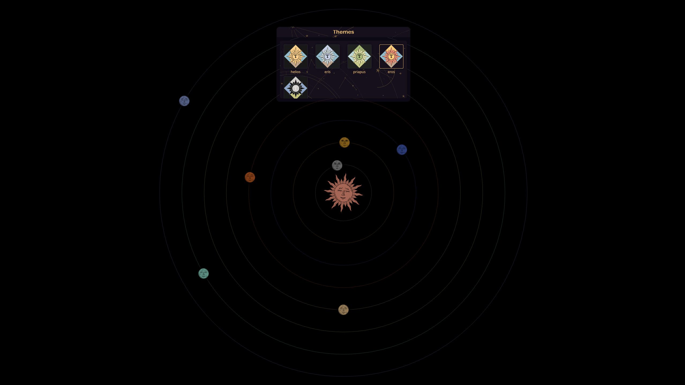

#  Maeby Antiquity 

 **A highly modified version of [diinki's beautiful linux-antiquity](https://github.com/diinki/linux-antiquity).** 
 
Please give their [incredible video of it](https://youtu.be/qOoWQeIGKiA?si=2_cWwcehLVZyCfHv) a watch.

 

  
## About

  
I loved the theme and imagery of diinki's original version, but wanted a different design. I also use KDE Plasma and wanted something that suited how I use it a bit more to my tastes.

I haven't touched any of the hyprland or kitty config files, so hopefully everything there is still compatible. I'll do my best to avoid touching anything that might mess with those.

There is also an option (enabled by default) to make the planets orbit the sun in "real-time". Using real orbit durations, it will calculate where it is on its orbit relative to a date configured in the config file (default is Jan 1, 2000). For example, if you set this target date to the day you read this, all planets would be in a straight line above the sun. After 88 days, Mercury would have returned back to this position (because it orbits the sun every 88 days) but Mars would have moved 46 degrees (because it would be 12-13% of the way through its orbit around the sun).

 

> [!CAUTION]
> I haven't made efforts to optimize or check compatibility. While it runs fine for me, it might not for you.
> 
> While I have a good amount of programming experience, I don't have much with Quickshell so I'm still learning. Please be patient with me. Any constructive criticism is welcome.
> 
> I will be using this as my main theme and even though I'm busy, I'll try to put out updates as much as I can.

 

## New Design

This new design has the sun in the middle of the screen with the 8 planets orbiting around it. Clicking the sun or a planet will open up a popup for the power management, app launcher, etc.

Right now...
* Sun: Power Management
* Mercury: Favorite Apps
* Venus: Theme Picker
* Earth: Main Menu
* All others: App Launcher

Like the original, this is intended to be highly customizable. Planets can be recolored, their paths can be recolored, hidden, or made to match the color of the planet.

 

  
## Screenshots

  
## New Config Options

I made sure to keep this theme as customizable as possible, so there are several new configuration options so you can set it up however you like. 
  
These new options include:
  
* Planet color for every color theme
* Planet size
* Sun Size
* Distance from the Sun for each planet
* Fixed/Real-Time planet angles
    * Fixed lets the user choose which angle each planet is at
    * Real-Time updates the orbit with real-world orbit durations relative to the target date
* Target Date for Real-Time planet angles (default is Jan 1, 2000)
* Transparency for orbit paths
* Orbit path override (if you want to hide the orbit paths or make them all the same color)
  

 

## Planned Features

There are some features I'm planning on working on very soon. These include:
* Unique icons for each planet
* Animated/simulated planet orbits (so each planet completes an orbit every couple minutes or hours, rather than dozens of days or years)

There are some more features I've considered, but haven't dedicated myself to doing yet. These include:
* Planet labels
* Information panel about each planet, including how many orbits they've completed since your chosen date
* KDE Theme update (window decoration, application style, icons, etc.)

Please let me know if you have more ideas for features!

